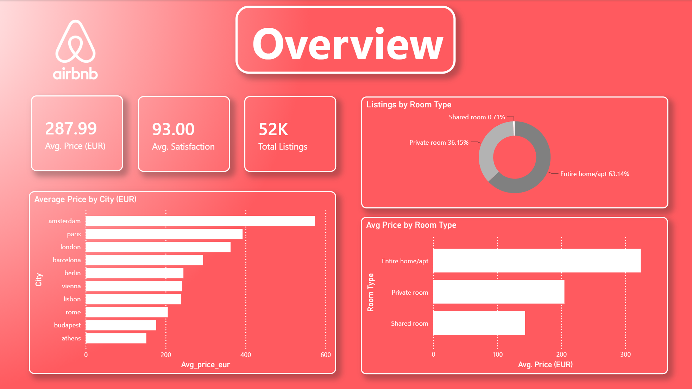
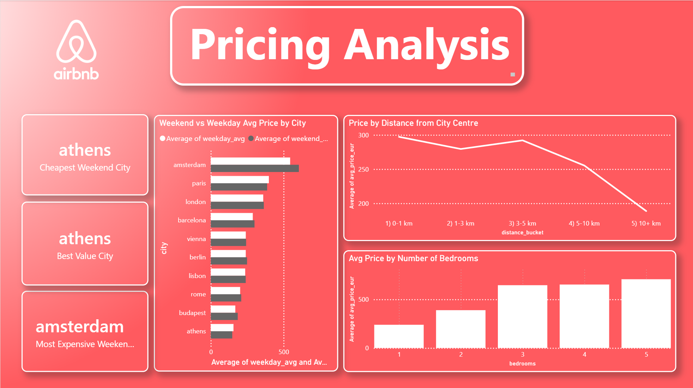
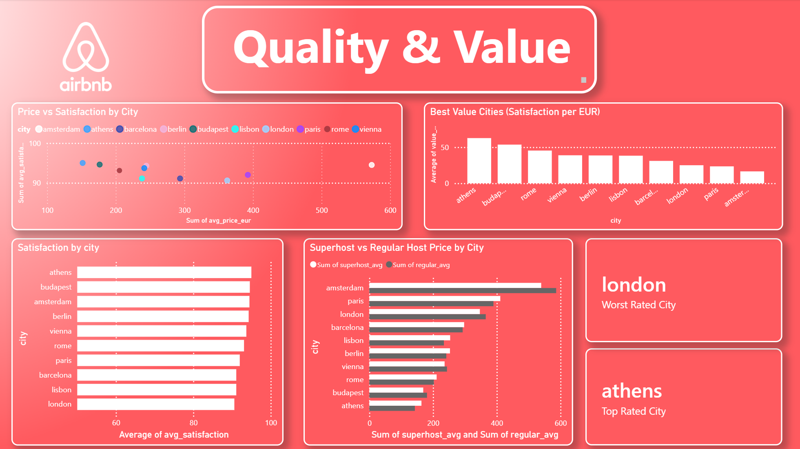
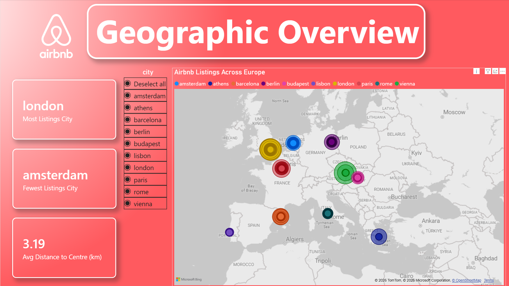

# 🏠 Airbnb European Cities — SQL & Power BI Dashboard

An end-to-end data analytics project analysing **51,700 Airbnb listings** across 9 major European cities using SQL for data analysis and Power BI for interactive visualisation.

---

## 📊 Dashboard Pages

| Page | Description |
|---|---|
| **Overview** | High-level KPIs, average price by city, listings by room type |
| **Pricing Analysis** | Weekend vs weekday premiums, price by distance to centre, bedroom pricing |
| **Quality & Value** | Guest satisfaction rankings, price vs satisfaction scatter, best value cities |
| **Geographic Overview** | Interactive map of all listings with city slicer |

---

## 🔍 Key Findings

- **Amsterdam** is the most expensive city (avg €566/night) but has the **lowest guest satisfaction**
- **Athens** is the best value city — highest satisfaction per euro spent, and actually cheaper on weekends than weekdays (-5.3% weekend premium)
- **London** has the most listings but is the worst rated city
- **Entire home/apt** listings dominate at 63% of all listings, averaging €324/night vs €205 for private rooms
- Listings within **1km of city centre** command a ~50% price premium over listings 10km+ away
- **Superhosts in Athens** charge 14.5% more than regular hosts, while Amsterdam superhosts charge 8% less

---

## 🗃️ Dataset

**Source:** [Airbnb Prices in European Cities](https://www.kaggle.com/datasets/thedevastator/airbnb-prices-in-european-cities) — Kaggle

**Cities covered:** Amsterdam, Athens, Barcelona, Berlin, Budapest, Lisbon, London, Paris, Rome, Vienna

**Original paper:** Gyódi & Nawaro (2021), *Determinants of Airbnb prices in European cities*

**Key columns:**
- `realsum` — total listing price (EUR)
- `room_type` — entire home/apt, private room, shared room
- `guest_satisfacti` — overall guest satisfaction score
- `cleanliness_rati` — cleanliness rating
- `dist` — distance to city centre (km)
- `metro_dist` — distance to nearest metro (km)
- `host_is_superhos` — superhost status
- `bedrooms` — number of bedrooms
- `lat` / `lng` — coordinates for map visualisation

---

## 🛠️ Tools Used

| Tool | Purpose |
|---|---|
| **Python (pandas)** | Merging 20 CSV files into a single dataset |
| **SQLite** | Analytical queries — aggregations, CTEs, price segmentation |
| **Power BI Desktop** | Interactive 4-page dashboard with DAX measures |

---

## 📁 Project Structure

```
airbnb-europe-dashboard/
│
├── data/
│   ├── airbnb_europe_merged.csv       # Combined dataset (all cities)
│   └── query_results/                 # Exported SQL query results
│       ├── 1_avg_price_by_city.csv
│       ├── 2_weekend_vs_weekday.csv
│       ├── 3_room_type_breakdown.csv
│       ├── 4_superhost_premium.csv
│       ├── 5_price_vs_distance.csv
│       ├── 6_satisfaction_by_city.csv
│       ├── 7_best_value_cities.csv
│       ├── 8_bedroom_price_breakdown.csv
│       ├── 9_map_listings.csv
│       └── 10_top10pct_listings.csv
│
├── merge_airbnb.py                    # Python script to merge raw CSVs
├── analysis.sql                       # All SQL queries with comments
├── airbnb_europe_dashboard.pbix       # Power BI dashboard file
│
├── screenshots/
│   ├── overview.png
│   ├── pricing_analysis.png
│   ├── quality_and_value.png
│   └── geographic_overview.png
│
└── README.md
```

---

## ⚙️ How to Run

1. **Clone the repo**
```bash
git clone https://github.com/pkati2915/airbnb-europe-dashboard
cd airbnb-europe-dashboard
```

2. **Merge the raw data** (if starting from scratch)
```bash
pip install pandas
python merge_airbnb.py
```

3. **Run SQL queries**
- Open [sqliteonline.com](https://sqliteonline.com)
- Import `airbnb_europe_merged.csv`
- Run queries from `analysis.sql`

4. **Open the dashboard**
- Open `airbnb_europe_dashboard.pbix` in Power BI Desktop
- Refresh data sources if prompted

---

## 📸 Screenshots

### Overview


### Pricing Analysis


### Quality & Value


### Geographic Overview

